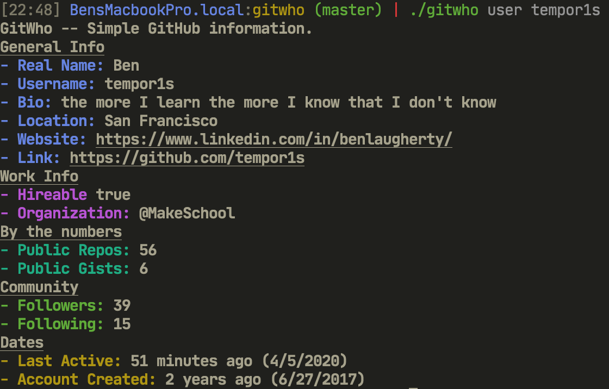
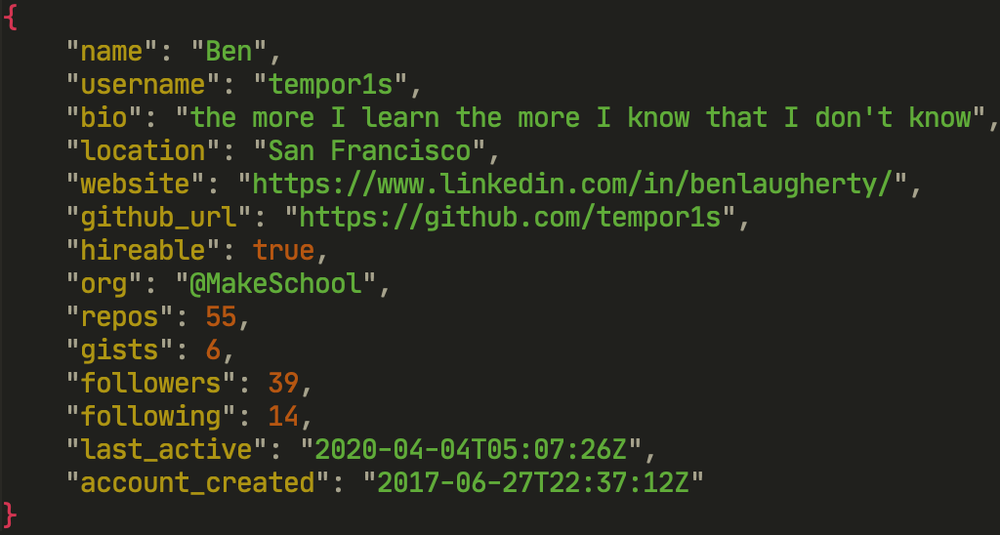
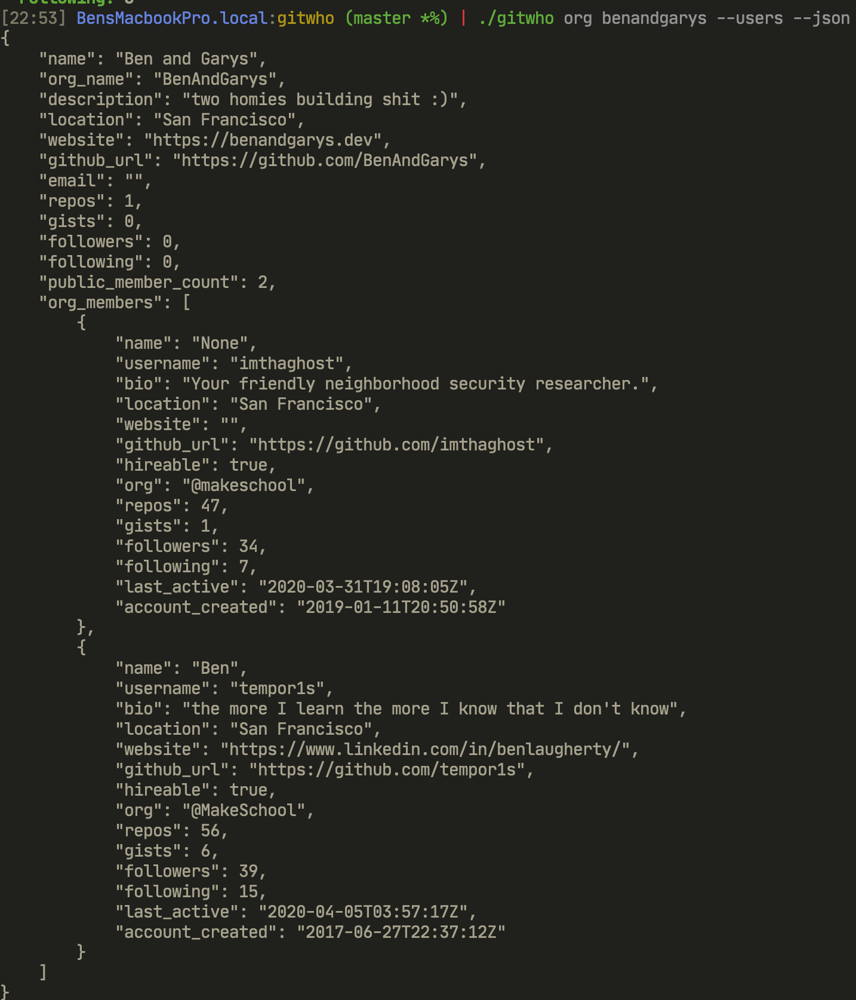

# gitwho

[](https://goreportcard.com/report/github.com/tempor1s/gitwho)

A simple CLI tool to get in depth Github Information about Users and Orgs!

## 🚀 Getting Started

### Use the tool!

```sh
# tap the repo
brew tap tempor1s/gitwho
# install the CLI tool
brew install gitwho
# get a list of all the commands
gitwho
```

## 💻 Features

### Quick Github User lookup


### Dump all outputs to JSON. (user, org, org members)


### Get Organization Information


### More soon! If you have anything to recommend feel free to open an issue!

